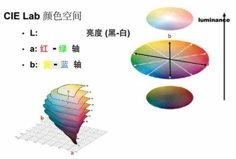

# INR2RGB 是一个灰度图片上色的深度学习神经网络
## 训练时将数据集RGB图片转到LAB空间下，用A，B通道的色彩信息作为标签，训练本程序中改进的自注意力跨层链接残差化的DCGAN网络进行训练，最后融合训练后的色彩信息与明度，实现对图像上色

# 训练脚本如下：
    !python train.py --data_dir='your data directory'
# 其他训练参数可输入 opt--h 来查询
# tensorboard 可视化命令：
    !bash tensorboard --log_dir='runs/tensorboard'
# 使用默认摄像头可以实现对黑白视频进行上色
    !python predict.py --data='0' --model=bast.pt
# coco数据集下载
    !mkdir ../datasets/coco
    !cd ../datasets/coco
    !mkdir images
    !cd images

## The form of your datasets:
for example
/datasets' name 
   // train   # This is required
    /// your train images  # Just need RGB form

    !wget -c http://images.cocodataset.org/zips/train2017.zip
    !wget -c http://images.cocodataset.org/zips/val2017.zip
    !wget -c http://images.cocodataset.org/zips/test2017.zip
    
    !unzip train2017.zip
    !unzip val2017.zip
    !unzip test2017.zip
    
    !rm train2017.zip
    !rm val2017.zip
    !rm test2017.zip

    !cd ../
    !wget -c http://images.cocodataset.org/annotations/annotations_trainval2017.zip
    
    !unzip annotations_trainval2017.zip
    
    !rm annotations_trainval2017.zip

